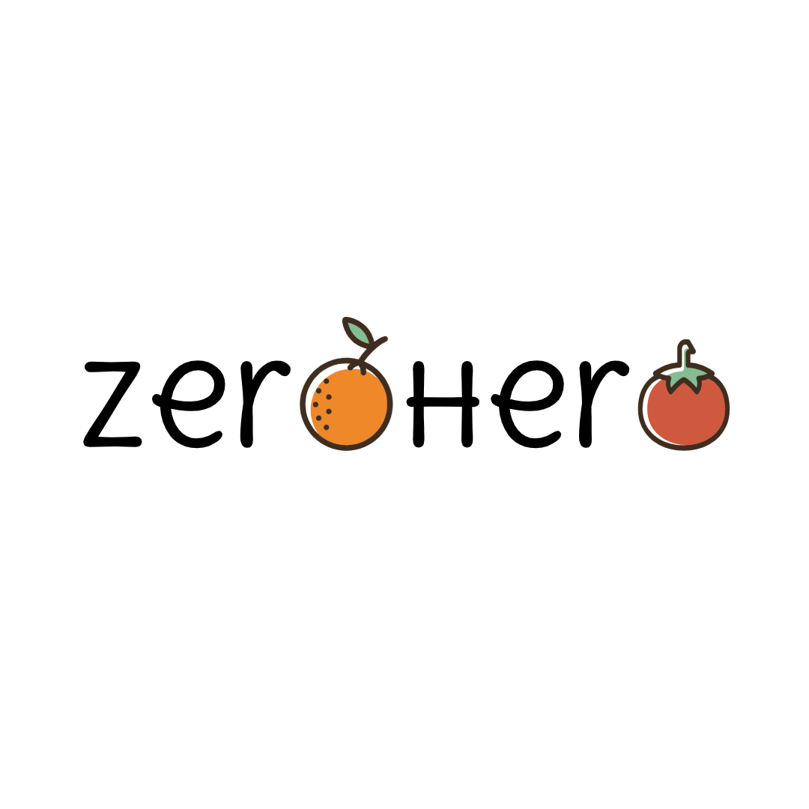

# ZeroHero

ZeroHero was my team's project for MHACKS 12. As a group of sophomore who started living outside of home, we're just starting out with grocery shopping. Sometimes we buy too much, and after we're done cooking there are ingredients left from various food items that may not be related to each other at all. ZeroHero is an app which takes an image of the ingredients provided and provides links and nutritional information to recipes possible with this set of ingredients. With this, we hope to reduce food waste due to overbuying. See the [devpost](https://devpost.com/software/zerohero-reducing-food-waste-with-object-recognition) for this project!

## How to Use

Copy code in App.js to run on a project on snack.expo.io. Install the requirements and you will be able to simulate it in the web browser or on your expo app.

## How does it work

ZeroHero is built using React-Native. The expo camera is used to take the picture, which is passed through a cloud function to inference on a Google AutoML Vision Model. This model was trained on the produces we bought from Kroger during the hackathon and includes: Peppers, Tomatoes, Apples, Avocadoes, Onions, Lettuce, Bananas, and Carrots. The model identifies the multiple items in the image and returns it to the app, upon which we call the Spoonacular API, which identifies the recipes that use the most of these ingredients. We employ multiple calls to the API to gather the recipes' image, nutritional information, and the link to the actual recipe. A video demonstration of the project can be seen [here](https://youtu.be/r0LnYwJ1I-8).